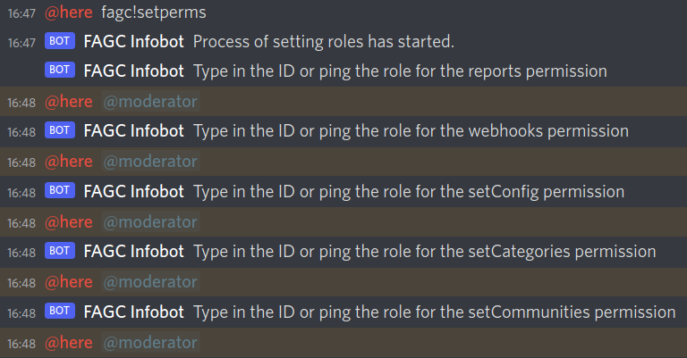

# Connection to an instance

This page describes how to connect to an existing FAGC instance in order to benefit from banlist synchronization.

1. Invite the bot to your Discord server through [our invite link](https://factoriobans.club/api/discord/oauth/url). The bot will ask for some
   permissions that are necessary for it to function properly, so please do not disable some of them
2. Once you have the bot in your server, you can use the `fagc!setperms` command to set permissions for commands.
   Only the server owner can do this initially. See the image below for how this looks
     <!--  -->
3. Once you have set the permissions, you can set your community and category filters. This is when FAGC comes into play,
   as these filters are what ensures that players are banned only from communities you trust and categories you yourself acknowledge.
